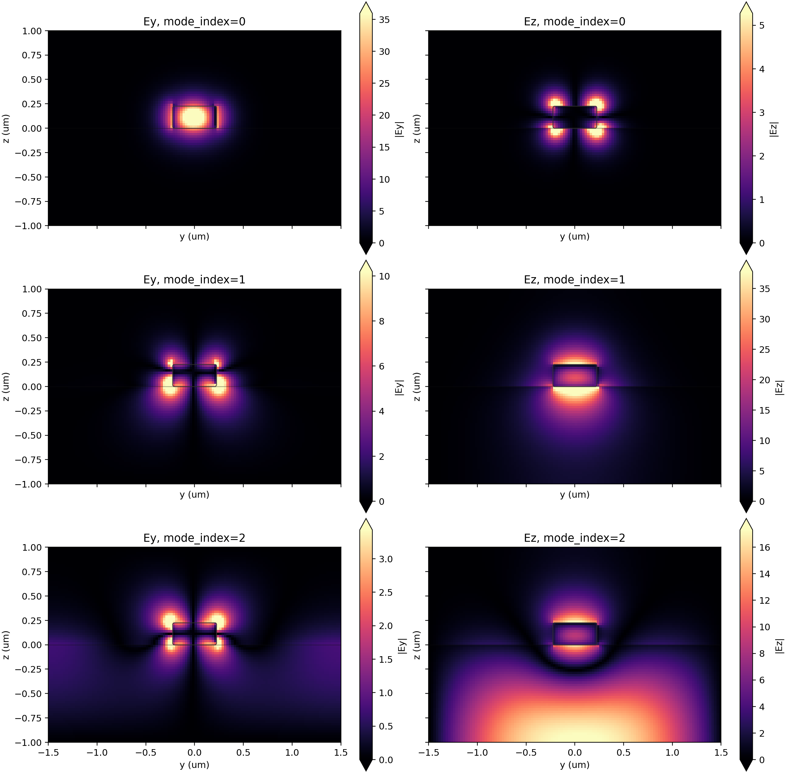
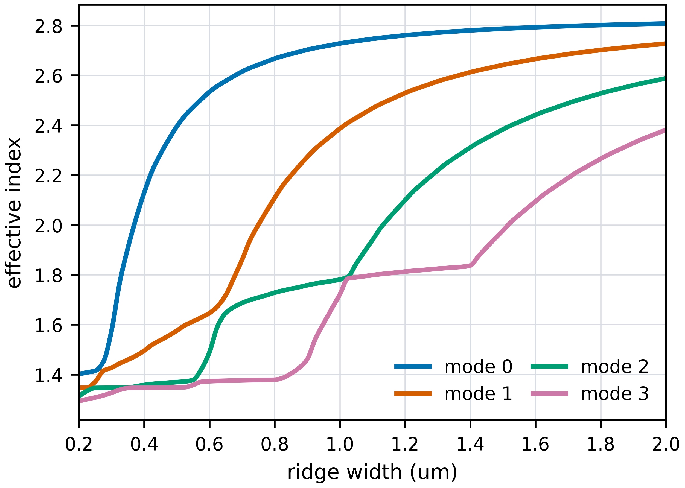

# micromode

An **electromagnetic mode solver** using the **[FDFD method](https://en.wikipedia.org/wiki/Finite-difference_frequency-domain_method)** on a **[rectilinear Yee-grid](https://en.wikipedia.org/wiki/Finite-difference_time-domain_method)**, with a readable **SciPy/ARPACK** backend and an optional native **[Rust](https://rust-lang.org/)** backend.

```bash
pip install "micromode[scipy]"
```

[](LICENSE)
[](https://github.com/QuentinWach/micromode/actions/workflows/tests.yml)

[](https://pypi.org/project/micromode/)


## Why Use It?

- **Grid-first API**: pass arrays directly, with no required geometry model.
- **Auditable SciPy default**: sparse operators are assembled in Python and
  solved with SciPy/ARPACK when SciPy is installed.
- **Optional Rust backend**: a portable native fallback for environments that do
  not want a SciPy dependency.
- **Practical** outputs: fields, `n_eff`, `k_eff`, mode area, polarization fractions,
  Lorentz overlaps, plotting, dataframe export, and HDF5 save/load.
- **Tensor-aware**: supports scalar, diagonal anisotropic, and full tensor material
  grids.
- Works for both **2D cross sections and 1D slices**.

You give it a material grid. It returns guided modes: effective indices, six-component fields, polarization metrics, mode area, overlaps, diagnostics, plots, and HDF5 output. MicroMode is intentionally not a CAD or geometry package. It is the solver piece you use after geometry has already been rasterized onto a mode-plane grid.

_Micromode is the **default mode solver** in the [BEAMZ FDTD engine](https://github.com/beamzorg/beamz)._


## Quick Start

```python
import micromode as mm

wavelength_um = 1.55
freq = mm.C_0 / wavelength_um

# Arrays from your own rasterizer.
eps_xx, x_edges, y_edges = mode_plane_arrays(...)

materials = mm.Materials.from_diagonal(
    eps_xx=eps_xx,
    x_edges=x_edges,
    y_edges=y_edges,
)

data = mm.solve_modes(
    material_grid=materials,
    freqs=[freq],
    num_modes=2,
    target_neff=2.5,
)

print(data.n_eff.values)
data.plot_field("Ex", mode_index=0)
data.to_hdf5("modes.h5")
```

## Examples


### Tidy3D Waveguide


The Tidy3D modal monitor example recreates the strip-waveguide setup from
Flexcompute's modal sources and monitors notebook. It solves the first three
x-propagating modes of a silicon waveguide on a silica substrate and plots
`|Ey|` and `|Ez|` on the same y-z mode plane. (See [Tidy3D, "Defining Mode Sources and Monitors"](https://www.flexcompute.com/tidy3d/examples/notebooks/ModalSourcesMonitors/).)

```bash
uv run --extra dev python examples/tidy3d_modal_sources_monitors.py
```

### Hybridization Sweep


The SOI hybridization example sweeps the width of a 220 nm silicon ridge and
solves several modes at each step. It shows how nearby modes exchange character
as the geometry changes by plotting effective index and TE fraction across the
sweep, then rendering representative field profiles.

```bash
uv run --extra dev python examples/soi_hybridization_sweep.py
```


## Physics

MicroMode solves the source-free frequency-domain Maxwell equations on a rasterized Yee mode plane, $\nabla\times\mathbf{E}=-i\omega\mu\mathbf{H}, \; \nabla\times\mathbf{H}=i\omega\epsilon\mathbf{E},$ with modal fields $\mathbf{E},\mathbf{H}\propto e^{i k_0 n_\mathrm{eff} z}.$

On diagonal material grids this becomes a transverse eigenproblem,
while full tensor or transformed grids use a first-order tensorial form. The
detailed derivation is in [docs/physics-model.md](docs/physics-model.md), and
the public solver controls are summarized in [docs/mode-solver-methods.md](docs/mode-solver-methods.md).


## Solver

MicroMode defaults to a Python/SciPy backend when SciPy is installed. This path
assembles the finite-difference sparse operators in Python and solves the
shift-invert eigenproblems with
[SciPy/ARPACK](https://docs.scipy.org/doc/scipy/reference/sparse.linalg.html).
That makes the numerical method easier for academic users to inspect and
debug, while still using a trusted sparse eigensolver stack.

The recommended install includes SciPy:

```bash
pip install "micromode[scipy]"
```

The public APIs use `backend="auto"` by default. In auto mode MicroMode selects
SciPy when available and falls back to Rust otherwise. You can also choose a
backend explicitly:

```python
data = mm.solve_modes(..., backend="scipy")  # same as backend="scipy-reference"
data = mm.solve_modes(..., backend="rust")
```

The Rust backend remains useful when a deployment needs a self-contained native
solver with no SciPy, ARPACK, BLAS/LAPACK, or Fortran toolchain requirement. It
uses sparse finite-difference operators, AMD fill-reducing ordering, sparse LU
factorization, and a shift-invert Arnoldi iteration. The SciPy and Rust paths
are compared in tests so their effective indices and normalization diagnostics
stay aligned on supported cases. See
[docs/backend-trust.md](docs/backend-trust.md).
